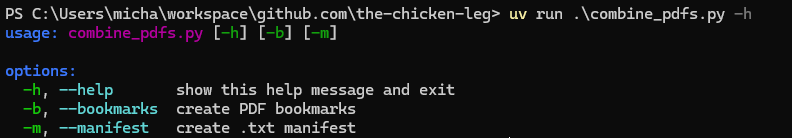
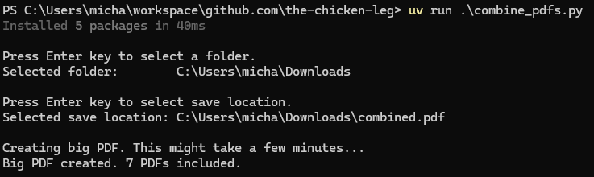
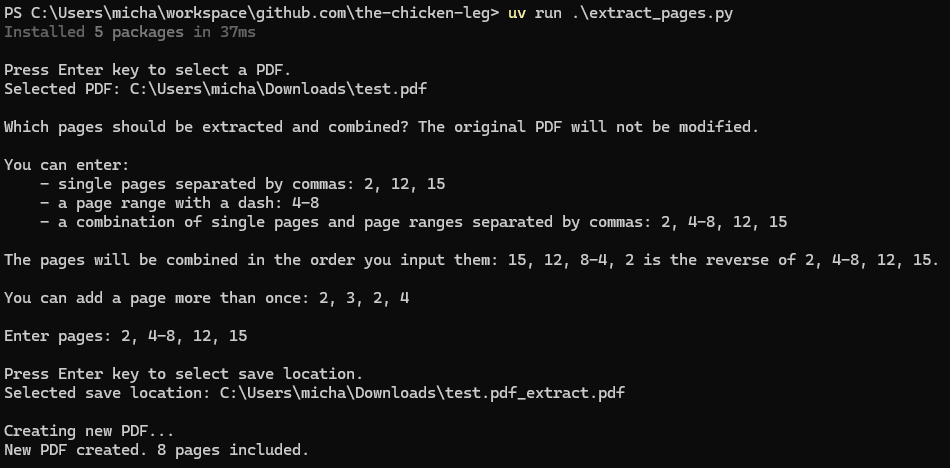

# bigPDFmaker

These Python scripts manipulate PDFs.

combine_pdfs.py combines PDF documents from a folder (non-recursively) into a big PDF (sorted by filename) - the original PDFs are not modified.

extract_pages.py copies selected pages from an existing PDF and creates a new PDF - the original PDF is not modified.

Using these scripts together allows endless mish-mashing of pages from multiple PDFs.

## Usage

### combine_pdfs.py





### extract_pages.py



## Run on Windows with uv

1. Install uv using PowerShell (full instructions here: https://docs.astral.sh/uv/getting-started/installation):

```powershell
powershell -ExecutionPolicy ByPass -c "irm https://astral.sh/uv/install.ps1 | iex"
```

2. Verify uv installed correctly:

```powershell
uv --version
```

3. Download script files:

```powershell
curl -L -O https://github.com/the-chicken-leg/bigPDFmaker/blob/main/combine_pdfs.py?raw=true
```

```powershell
curl -L -O https://github.com/the-chicken-leg/bigPDFmaker/blob/main/extract_pages.py?raw=true
```

4. Run using uv. On the first run, uv will download the appropriate Python version, create a virtual environment, and install dependencies, which might take some time. Subsequent runs will be faster:

```powershell
uv run .\combine_pdfs.py
```

```powershell
uv run .\extract_pages.py 
```
